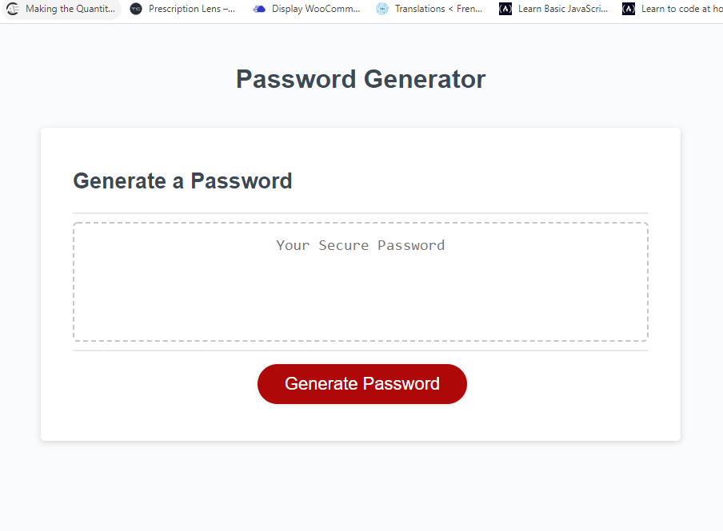
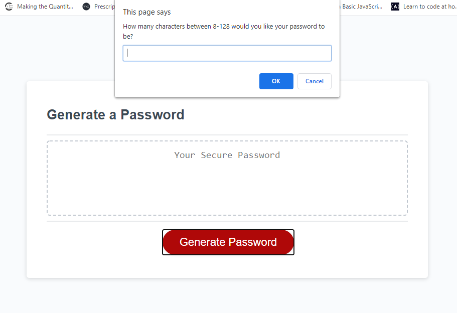
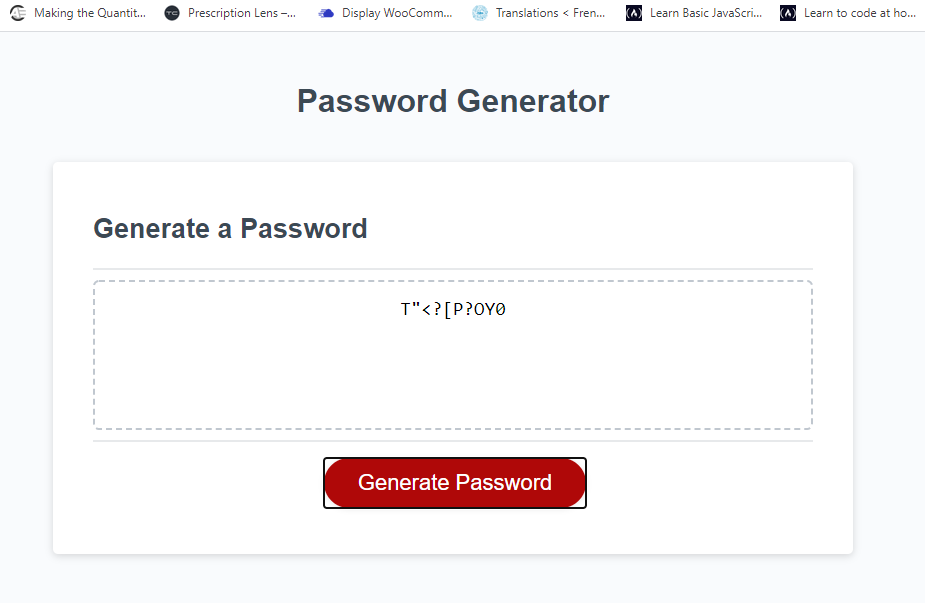

# <Horiseon_Mockup>

Please view the Password Generator Project Here: [Password Generator Project](https://leonhsu95.github.io/password-generator-project/)

## Description

As it suggests, thet task is to make an interactive Password Generator when the user presses the "Generate Password" button. By default, the JavaScript functionality does not work and the task is to make so that when the "Generate Password" button is pressed, it will create a random password as per the user's number of character and character-type choices.

## Table of Contents (Optional)

- [Installation](#installation)
- [Usage](#usage)
- [Credits](#credits)
- [License](#license)

## Installation

To install the files into your local repo, using Git Bash Terminal:

1) Create a folder locally to nominate for cloning from online repo
2) Clone with SSH by

```GitBash Commands
git clone git@github.com:leonhsu95/password-generator-project.git"
 ```

## Usage

This landing page is a mockup and can be used and tested freely. If testing, please save a copy of the original files and edit on the copied file.
The website mockup should look like this:
 
 
 

## Credits

All resources were provided by "University of Sydney Bootcamp" by Kory Porter in [GitLab Repo](https://sydney.bootcampcontent.com/university-of-sydney/usyd-syd-fsf-pt-02-2021-u-c), and coded by Leon Hsu.

## License

Copyright (c) [2021] [leonhsu95]

Permission is hereby granted, free of charge, to any person obtaining a copy
of this software and associated documentation files (the "Software"), to deal
in the Software without restriction, including without limitation the rights
to use, copy, modify, merge, publish, distribute, sublicense, and/or sell
copies of the Software, and to permit persons to whom the Software is
furnished to do so, subject to the following conditions:

The above copyright notice and this permission notice shall be included in all
copies or substantial portions of the Software.

THE SOFTWARE IS PROVIDED "AS IS", WITHOUT WARRANTY OF ANY KIND, EXPRESS OR
IMPLIED, INCLUDING BUT NOT LIMITED TO THE WARRANTIES OF MERCHANTABILITY,
FITNESS FOR A PARTICULAR PURPOSE AND NONINFRINGEMENT. IN NO EVENT SHALL THE
AUTHORS OR COPYRIGHT HOLDERS BE LIABLE FOR ANY CLAIM, DAMAGES OR OTHER
LIABILITY, WHETHER IN AN ACTION OF CONTRACT, TORT OR OTHERWISE, ARISING FROM,
OUT OF OR IN CONNECTION WITH THE SOFTWARE OR THE USE OR OTHER DEALINGS IN THE
SOFTWARE.

## Features

- If the user registers enters nothing or not a number, the function will restart until the user enters a number.
- If user enters a decimal number, it will be rounded to an integer.
- Special Characters does not contain a " " character. 

## Tests

Website is validated with [HTML Markup Validation Tool](https://validator.w3.org/), [CSS Validation Service](https://jigsaw.w3.org/css-validator/) and [JS Validation Service](https://jshint.com/).
